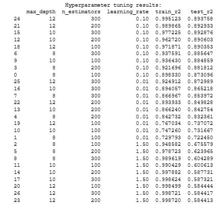

# CS412-ML-Project
CS412 Instagram Data Analysis Project

# Overview
This repository contains the scripts and models used for the Fall 2024-2025 CS412 Term Project and the results obtained.

The first thing done was feature analysis. This [file](./feature_analysis_profile.ipynb) contains code to traverse the given dataset and examine the features. 
We eliminate features we think are irrelevant and check if there are null-values to be dealt with. We drop features that are mostly null. Also we drop features with low variance.

Then in this [file](./feature_extraction_profile.ipynb) , we tfidf-vectorize our textual data and merge some of the features together. How we handled the textual data and how we used categorical data impacted our classification score considerably. In this file we also tried some initial classifiers like Random Forest, and Word2Vec. It also includes our final BERT classifier.

Finally, our last [file](./regression_randomforest.ipynb) includes our regression model, built on the instructive notebook provided.

# Methodology

### 1) Profile-level Feature Analysis

The ML model development started with a feature analysis step run on the profile-level information from the training dataset. The main aim of this step was to determine the importance levels of different features from the data as well as the relationships between these features, so that the model can be trained on features that would give distinctive information about different data points to enable better predictions. The related code and further details for this step can be found in [this](./feature_analysis_profile.ipynb) notebook. 

Initially, each data point had 44 profile-level features and 35 associated posts. The first step was to eliminate features that are unique for each data point, such as IDs, and eliminate highly complex features that would be too hard to extract useful information from in the scope of this project, such as URL columns and profile pictures. This initial elimination step resulted in the dropping of 11 features. After that, any feature with missing data for more than 25% of the data points were dropped, resulting in the removal of 8 more features including overall category name and business email. In the remaining 25 features, all remaining missing data was seen to be in textual features such as full name and biography, so they were filled with empty string for simplicity.

After these eliminations were completed and all null data was filled or removed, variance of numeric features were calculated. The reason is that this variance value is important in the sense that a low variance indicates a non-discriminative feature that can be removed from the dataset. A variance threshold of 1e-3 was selected, which eliminated 10 more features such as if the profile is private or if the user joined Instagram recently, resulting in 15 features left from the dataset. Additionally, the business contact method feature was eliminated as well since 47% of the data points had “UNKNOWN” for this column, leaving 14 features to work with. 

Next, a correlation analysis was performed on the remaining numerical and boolean type features. In order to make more sense of the relationships, the profile label data from student annotations was incorporated into the dataset and the mutual information with respect to each feature was measured. A mutual information threshold of 0.028 was determined to eliminate non-informative features with respect to the profile labels, which eliminated 4 more features from the dataset ('should_show_category', 'has_clips', 'hide_like_and_view_counts' and 'should_show_public_contacts'). 

At the end of feature analysis, 10 features remained from the initial 44 features of the dataset. The remaining features are: ‘username’, ‘full_name’, ‘biography’, ‘category_name’, ‘follower_count’, ‘following_count’, ‘is_business_account’, ‘is_verified’, ‘highlight_reel_count’, ‘entities’. 

### 2) Profile-level Feature Extraction for Classification
The next step in the ML model development process was to extract features from textual features that remained at the end of the feature analysis process. The related code and further details for this step can be found in [this](./feature_extraction_profile.ipynb) notebook. 

Initially, all text based features ('category_name', 'biography',  'entities', 'full_name') were combined into a single feature by concatenation. It should be noted that normally, since the category name is a categorical value, it should have been numerically encoded. However, the ‘category_name’ column had 432 categories which was too much for incorporating in an encoded format. So the information from the category name was attempted to be utilised inside the combined textual feature. After concatenation, the combined textual feature was processed using Natural Language Toolkit (NLTK), where turkish stopwords (such as “ve”, “ile”, “bir” etc.), links, special characters, hashtags, mentions, numbers and extra whitespaces were removed.

The original dataset had mostly 35 posts attached to each user in the dataset with 7 post-level features. In the next step of feature extraction, post-level information related to each user was combined into 5 features: ‘total_likes’, ‘total_comments’, ‘max_likes’, ‘average_likes’ and ‘captions_concatenated’. Then, combined textual features were concatenated with the combined post captions into a single textual feature, and the same processing was applied using NLTK for consistency. This resulted in a single processed textual feature for each username. The profile label data from student annotations was incorporated into the processed data to form the final structure of the training data for the classification model training.

### 3) Classification Models
A number of machine learning algorithms were tested to develop a classification model that could predict the labels of Instagram user profiles from one of the ten categories: Art, Entertainment, Fashion, Food, Gaming, Health and Lifestyle, Mom and Children, Sports, Tech and Travel. The related code and further details for this step can be found in [this](./feature_extraction_profile.ipynb) notebook. 

One classification model was developed using TF-IDF features with a Random Forest Classifier. For this model, the combined and processed textual feature was vectorised using TF-IDF vectorizer, with max_features set to 5000. The dataset was then splitted into training and test subsets with 80:20 ratio. Then, a Random Forest Classifier was fitted onto the vectorised training data with default parameters, and its success on classification of the test data was measured with a classification report of precision, recall, F1-score and support metrics. In this attempt, TF-IDF algorithm was considered since it focuses on the most informative words by assigning higher weights to rare but important terms, which may be helpful in determining the label of an Instagram profile. However, one drawback was that it loses semantic meaning and word order, since it treats words independently.

As an attempt to utilize the TF-IDF features obtained from the post captions, a Bayes Classifier was also tried. The approach was based on asking the question “What is the probability this is an account of X given that it posts about Y?” The post captions were the most relevant information for this classifier, yet the post dataset at hand turned out to be insufficient for this task. The posts made from accounts under the same label differed too much over the board that the classifier was not able to derive sound links between captions and labels. With a 80:20 split, this model could only achieve around 50% validation accuracy. Yet it was still suspected that captions would be an important part of predicting the label of an account, so we used this in the following models.

Additionally, a Logistic Regression approach was used for the classification task. The same features as in Random Forest Classifier and Bayes Classifier were used in training. Max iterations hyperparameter was tuned to achieve the highest accuracy. The classification report of precision, recall, f1-score and support was used for evaluation as before.    

Another classification model was developed using Word2Vec embeddings with a Random Forest Classifier. For this model, the combined textual features were tokenized into words and used to train a Word2Vec model, which produced 100-dimensional dense word vectors that capture semantic relationships between words. To represent entire sentences, word vectors for all words in a sentence were averaged into a single sentence vector. These sentence vectors were then scaled using StandardScaler to ensure the features had zero mean and unit variance. The dataset was split into training and test subsets with an 80:20 ratio. A Random Forest Classifier was then trained on the scaled sentence vectors with default parameters, and its success in classifying the test data was evaluated using a classification report with metrics like precision, recall, F1-score, and support. Word2Vec was chosen because it retains semantic relationships between words, making it more robust for understanding the meaning of text. However, a limitation is that it loses information about word order, and the sentence representation depends heavily on the averaging of word vectors, which may not capture the full context of the text.

Another classification model was developed using a pre-trained Turkish BERT model to utilise its ability to capture contextual embeddings. The dataset was tokenized using the BERT tokenizer, converting raw text into token IDs and attention masks while ensuring all sequences were padded or truncated to a maximum length of 256 tokens. A custom PyTorch Dataset class handled this preprocessing. The labels were mapped to numeric values, and the dataset was split into training and test sets in an 80:20 ratio. Then, a BERT-based classifier was fine-tuned for the task. The architecture included the pre-trained BERT model as the base, followed by a dropout layer to prevent overfitting and a fully connected layer to classify the outputs into the desired number of classes. The model was trained over 5 epochs using the AdamW optimizer with a learning rate of 3e-5 and a cross-entropy loss function. During training, batches of data were processed, and the average loss was monitored to ensure learning stability. For evaluation, predictions were generated on the test set, and the model's performance was assessed using a classification report that measured precision, recall, F1-score, and support metrics. This process demonstrated the effectiveness of BERT in classifying Turkish text by capturing semantic relationships and context within the data. However, the approach was computationally demanding, required careful parameter tuning, and may have lost some information in very long texts due to sequence truncation.

### 4) Post-level Feature Extraction for Regression

For the development of a regression model to predict like counts for Instagram posts, a number of steps were taken to prepare a training dataset. The related code and further details for this step can be found in [this](./regression_randomforest.ipynb) notebook. 

Initially, post-level features ('post_id', 'caption', 'like_count', 'comments_count', 'media_type', 'profile_id') from the training dataset were extracted and combined with important profile-level features, which were mainly determined in the feature analysis step. Then, an exploratory data analysis was performed to understand the relationship between post-level features and their distributions. For this purpose, multiple plots were produced to understand trends in data, which was used later on for data processing.

In addition to existing features from the training dataset, a feature engineering step was conducted to create new features that would uncover informative relationships. For this purpose, the following values were calculated for each username: followers per post, comments to followers ratio, average like count for a user, average comment count for a user and hashtag count in a post caption. Their distributions were also plotted to understand their properties, so that they can be incorporated into the model training. 

After the original and engineered data features were extracted, the obtained data set was processed. In this step, numerical features were log-transformed in order to prevent the model from being affected by the heavy tailed distributions of features, which was a fact discovered during exploratory data analysis. The caption data for each post was processed using Natural Language Toolkit (NLTK), in the same manner of feature extraction for classification (i.e. where turkish stopwords (such as “ve”, “ile”, “bir” etc.), links, special characters, hashtags, mentions, numbers and extra whitespaces were removed). Then, processed captions were vectorised with TF-IDF vectorizer with max_features set to 1000. After the media type of the post was encoded numerically, all TF-IDF features were combined with the post-level features. They were also scaled with StandardScaler to ensure the features had 0 mean and variance of 1, to form the final version of the dataset to be used in regression model training.

### 5) Regression Models

A number of regression models were tested to develop a regression model that could predict the like counts of an Instagram post based on its post-level information combined with profile-level information of the user. The related code and further details for this step can be found in [this](./regression_randomforest.ipynb) and [this]()notebook. 

After the data was extracted and prepared for the regression model training, a Random Forest Regression model was trained. Different values for the above parameters were tested for the model training, and the most successful one was determined to be the above combination of parameters for the training dataset. For the evaluation of the model, RMSE (root mean squared error) and R² (R-squared) values were used. Accordingly, the better-performing model was determined based on the presence of a low RMSE with a high R² value. RMSE quantifies how well the Random Forest model is predicting continuous target values. A lower RMSE indicates a better fit to the data. R² indicates how well the regression model explains the variance in the target. It ranges between 0 and 1, 1 indicating a perfect fit. Higher R² values indicate a better model.

Another model was trained using XGBoost (Extreme Gradient Boosting) algorithm for the regression task. It is an optimized gradient boosting framework that builds an ensemble of decision trees by sequentially adding new trees to correct errors made by previous ones. The hyperparameters were tuned such as number of estimators, learning rate and maximum depth of a tree based on the systematic evaluation of XGBoost models with varying hyperparameter values using nested loops to iterate through the combinations of different values.

# Results

### 1) Feature Analysis for Classification

The correlation analysis run before the classification models were trained was obtained as in Figure 1:

Figure 1. Correlation matrix for numerical features selected by feature analysis.

The matrix showed that some of the features have moderate correlations between each other, for example the feature "is_business_account" showed a positive correlation with "should_show_category" (0.16) and "should_show_public_contacts" (0.24), suggesting that business accounts tend to enable these settings. The matrix overall suggested weak correlations among most features, highlighting a lack of strong linear relationships in the data. 

The mutual information calculated for each of the numerical features from Figure 1 and the profile labels was obtained as in Table 1:

Based on the determined threshold of 0.028, it was seen that the features ‘follower_count’, ‘following_count’, ‘is_verified’, ‘highlight_reel_count', and ‘is_business_account’ had meaningful relationships with the profile labels. Features like ‘has_clips’ and ‘hide_like_and_view_counts’ scored 0, suggesting no dependency and were excluded from further analysis. This approach ensured only the most informative features were considered, improving the efficiency of the model.

### 2) Classification Models

Among the numerous models trained for the classification task, the following accuracy levels were obtained as in Table 2:

Table 2: Accuracy scores of different classification models.

The Word2Vec + Random Forest model achieved the lowest accuracy (0.51), likely due to its reliance on averaging word embeddings, which may have lost contextual information. The Bayesian Classifier slightly improved the performance to 0.57, but its inability to effectively model the variability in captions across labels limited its success. The TF-IDF + Random Forest model performed better, achieving an accuracy of 0.60, as it focused on the most informative terms, though it lacked semantic understanding. The Logistic Regression model further improved accuracy to 0.65, benefiting from its linear approach and tuned hyperparameters. Finally, the Turkish BERT model achieved the highest accuracy (0.72) by leveraging contextual embeddings and its ability to capture semantic relationships, though it required significant computational resources and careful fine-tuning. These results demonstrate that contextual and semantic features, as captured by BERT, are critical for the task, despite the computational overhead.

The classification report of Turkish BERT Classifier was obtained as in Table 3:

Table 3. Classification report of Turkish BERT Classifier model.

As seen from Table 3, Categories like gaming (precision: 1.00, recall: 0.80) and food (precision: 0.87, recall: 0.89) performed exceptionally well, indicating that the model effectively captured the contextual features of these labels. In contrast, categories such as art and entertainment had lower precision and recall scores, reflecting challenges in distinguishing these categories, likely due to overlapping features or insufficient training data. The macro average F1-score of 0.71 shows relatively balanced performance across all categories, while the weighted average F1-score of 0.72 indicates that the model performed better in categories with more support (e.g., health and lifestyle). 

### 3) Feature Analysis for Regression

The distributions of numerical features included for regression model training were obtained as in Figure 2.

Figure 2. The distributions of different numerical features included in regression modeling.

The obtained distribution plots from Figure 2 showed that all numerical attributes had a very uneven distribution. In order to reduce the effect of this unevenness, the data was log-transformed in the data processing step, so that the model can handle the heavy tailed distributions.

Similarly, the distributions of numerical engineered features included for regression model training were obtained as in Figure 3.

Figure 3. The distributions of different engineered numerical features included in regression modeling.

Similarly, these features also had very uneven distribution. Therefore, they were log-transformed to reduce their effect on model training.

### 4) Regression Models

Among the different Random Forest Regressors with different hyperparameters, the best combination of parameters were obtained to be as follows:

- n_estimators: The number of trees in the forest is 100.
- max_depth: The maximum depth of the tree is 10.
- min_samples_split: The minimum number of samples required to split an internal node is 5.
- min_samples_leaf: The minimum number of samples required to be at a leaf node is 4.

These hyperparameters improved the Random Forest Regressor by balancing model complexity and generalization. Limiting the tree depth to 10 (max_depth) and requiring a minimum of 5 samples to split (min_samples_split) and 4 samples per leaf node (min_samples_leaf) prevented overfitting by avoiding overly complex trees that capture noise. At the same time, using 100 trees (n_estimators) ensured robust predictions by averaging outputs from multiple trees, reducing variance. Additionally, text processing used in the caption and the log-transformations included for numerical features improved the model performance further. The final version of the model yielded an R² of 0.80 for both the training and the test set.

  Training RMSE (Original Scale): 30086.19
  
  Testing RMSE (Original Scale): 20604.29
  
  Training R² (Original Scale): 0.80
  
  Testing R² (Original Scale): 0.80

In comparison, the developed XGBoost model performed better than the Random Forest Regressor. A systematic evaluation of XGBoost models with varying hyperparameter values was conducted, and the results were presented in Table 4. As observed from the table, some combinations resulted in very high training scores compared to test scores, indicating potential overfitting. To address this issue, parameters that produced relatively closer scores during training and testing were selected. The chosen parameters were a max_depth of 8, n_estimators of 100, and a learning_rate of 0.1. These parameters yielded an R² of 0.89 for the training set and 0.87 for the test set.

Table 4. XGBoost results. 

# Contributions

* Sıla:
* Taha:
* İlayda:
* Kemal:
